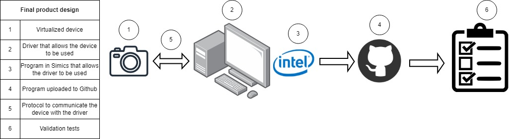

# Product design

The product design consists of the following parts:

1. A virtualized device to perform hardware simulation. By doing this, the device can capture, transform, and filter photos or images. Finally, these filtered images/photos will be sent to a virtual environment that uses Ubuntu as its operating system.

2. A driver that works on Ubuntu. This driver will allow any process in the operating system to access the device.

3. Program that allows the user to apply filters to the image to verify the correct operation of the driver and the device uploaded to the Github repository.

4. Protocol that allows communication between the virtualized device and the driver.

5. Tests to verify the correct operation of the device and the filters.

Image 1: Design of the product

[Return to README](../README.md)
