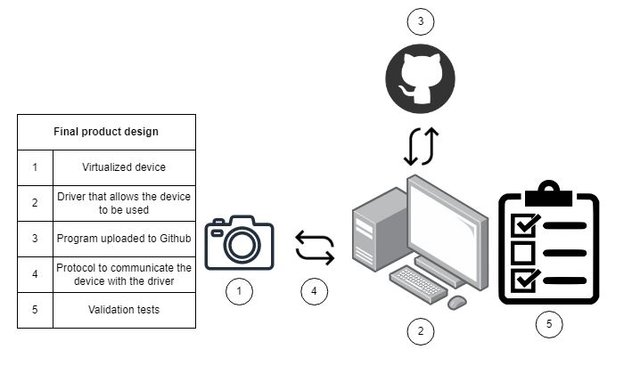

# Product design

The product design consists of the following parts:

1. A virtualized device to perform hardware simulation to capture, transform and filter photos or images and send the result of the filtered image to a virtual environment using Ubuntu as the operating system.

2. A driver that works on Ubuntu. This driver will allow any process in the operating system to access the device.

3. A program that allows the user to apply filters to the image to verify the correct operation of the driver and the device.

4. All code created uploaded to the Github repository.

5. Protocol that allows communication between the virtualized device and the driver.

6. Tests to verify the correct operation of the device and the filters.

Image 1: Design of the product
